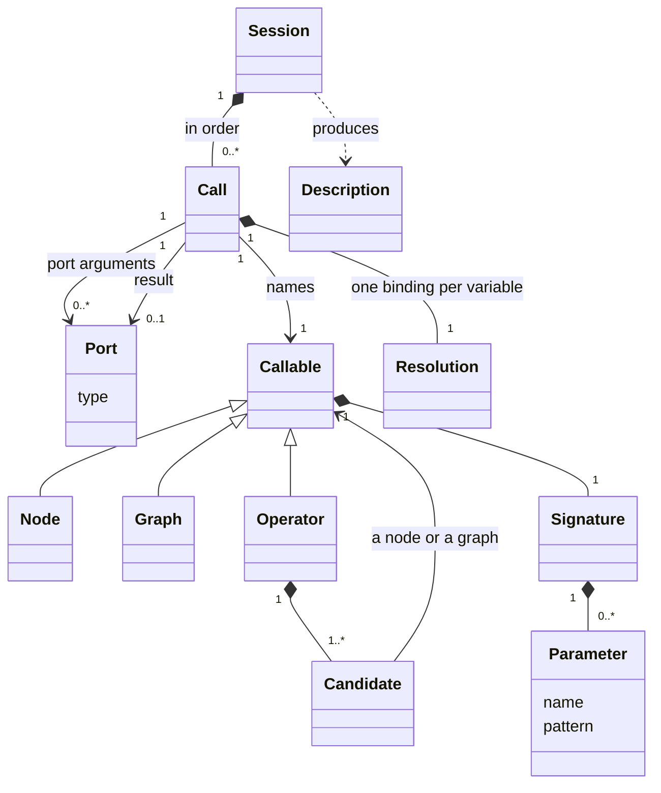
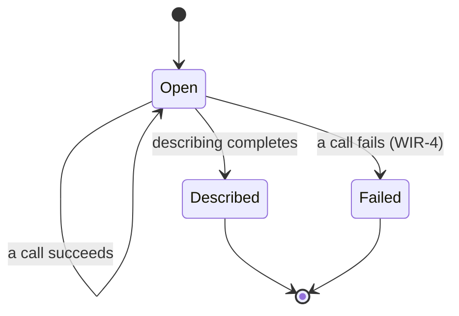
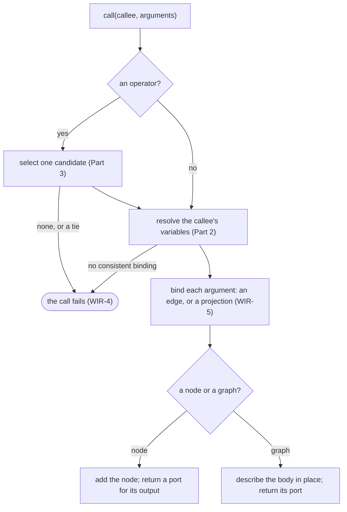
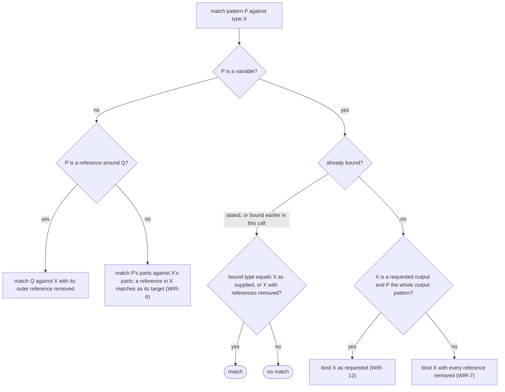
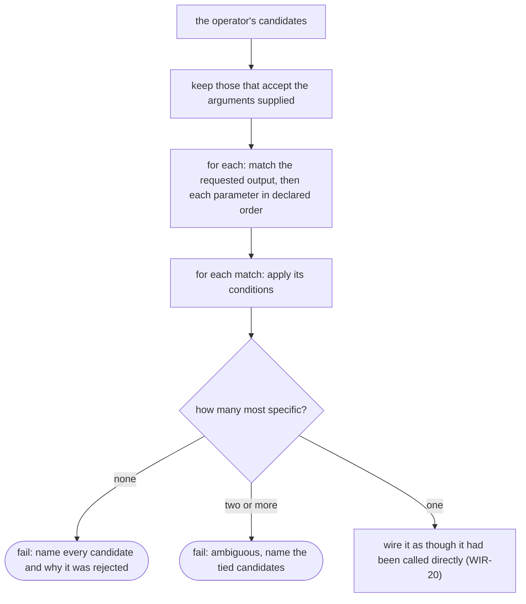

Wiring
======

Status: draft. Rewritten as a generic model on 2026-09-30 after the owner's
review; the rules WIR-1 to WIR-24 keep their numbers and their meaning. Type
resolution (Part 2), projections (WIR-5) and candidate selection (WIR-16 to
WIR-18) are validated against two independent implementations
([wiring validation](https://github.com/hhenson/hgraph_spec_audit/blob/main/runtime/validation/wiring/README.md)); the Evidence table
says which rules rest on cases and which on source reading only.

Wiring is how a graph is **described**. It is not the runtime: it produces
the description the runtime instantiates from, and once that description
is complete nothing here applies any more. It is specified apart from the
runtime because it is shared by every front end that describes graphs — a
language such as HGL, a library in a host language such as Python or C++,
a tool that loads a stored description — and it is what keeps them in line.
The runtime begins at the
[builder boundary](../runtime/overview.md#the-builder-boundary).

Two words in this document have narrower meanings than in everyday use:

- An **operator**, here, is a wiring concept: a name that stands for
  several implementations and is resolved to one of them at each call. It
  is not the runtime's concern; after wiring there are only nodes.
- A **library operator** is one of the operators a standard library
  provides — addition, union, formatting — and what such an operator
  *publishes* is a library contract, not a wiring rule. Those contracts
  live in the [library](../library/README.md). This document says how a
  call to any operator, library or user-defined, is resolved; it says
  nothing about what the selected implementation then does.

Concept
-------

### Calls and ports

A graph is described by making **calls**. A call names something callable
and supplies **arguments**. There are three kinds of callable:

| Callable | What a call does | What it returns |
|---|---|---|
| a **node** | adds one node to the description, with its arguments bound to the node's inputs and scalars | a port for the node's output, if it has one |
| a **graph** | describes a sub-structure in place: the graph's own body makes calls, with the arguments standing in for its parameters. It adds no node of its own | the port its body returns, if any |
| an **operator** | selects one of the operator's implementations, its **candidates**, and calls that | whatever the candidate returns |

An argument is either a **port** or a **scalar**. A port is a time-series
that *will exist* when the described graph runs: it has a type and no
value, and nothing can be read through it, because the graph has not been
instantiated, let alone started. A scalar is a value that is fixed now and
becomes part of the node's configuration.

### Signatures and patterns

Every callable has a **signature**: its parameters, each with a name and a
**pattern**, and the pattern of what it returns. A pattern is either a
concrete type or a type containing **type variables**: a variable standing
for any time-series type, for a scalar type, for a list's size, for a
bundle's set of fields. A signature that contains variables is **generic**.

Wiring a call to a generic signature **resolves** it: every variable is
bound to a type, and the call becomes as concrete as if it had been written
without variables. No variable survives into the description.

### The three decisions

Every call makes three decisions, and this document specifies each:

1. **Which implementation.** For an operator, which candidate. Part 3.
2. **What types.** How each variable binds. Part 2.
3. **How each argument binds.** A port argument becomes an edge from that
   port to the callee's input, or a projection of the port. The runtime
   says which pairs of types may be joined by an edge
   ([Time-series types](../runtime/time_series.md), TS-29); wiring applies
   that rule before the edge exists.

### References are explicit

A reference is a way of *reaching* a time-series, not a kind of value a
node computes with. A node written to consume values that is handed a
reference would format, compare or record the reference itself: plausible
output that is wrong. Wiring therefore never lets a type variable bind a
reference by accident. A node sees a reference only where its own
signature says so, or where the caller states it. This is the single most
consequential rule in wiring, and Part 2 is largely its consequences.

Relationships
-------------

- A **session** is one act of describing a graph. It holds the calls made
  so far, in order, and at its end produces one description.
- A **call** names one callable, takes ports and scalars, and returns at
  most one port. Its **resolution** records what every variable of the
  callee's signature was bound to.
- An **operator** owns its candidates. A candidate is a node or a graph
  with a signature of its own.

State
-----

| Item | Values | Changed by |
|---|---|---|
| session | open, failed, described | A call that fails; the end of describing |
| port type | fixed when the port is made | Nobody |
| resolution | one type per variable of the callee, fixed when the call is made | Nobody |

Wiring either produces a complete description or fails. A failure propagates
out of wiring, logically equivalent to a compiler failure; no description is
produced and there is no recovery (WIR-4). Partial wiring effects need not be
reversible. Conditional wiring is deferred; catching a failure is not a
supported way to choose another graph.

Behaviour
---------

### Part 1 — Rules of the session

- **WIR-1** Wiring describes a graph and never evaluates it. No time-series
  of the graph being described exists while it is described; a port has a
  type and no value. A value computed *during* wiring comes from a
  callable's **constant form**: an implementation that, given only scalars
  and resolved types, produces a scalar. It is selected exactly as a wired
  call would be (Part 3), reads no time-series, and to the description its
  result is a scalar like any other.
- **WIR-2** Every port has exactly one time-series type, fixed when the
  port is made. No type variable survives into a description.
- **WIR-3** A call binds each argument to a parameter of the callee's
  signature. A port argument becomes an edge to the callee's input, or a
  projection of a port (WIR-5); a scalar argument becomes part of the
  callee's configuration. An edge is admitted only when the runtime's
  binding rule admits its two types (TS-29), and a feedback edge never
  carries a reference (TS-28).
- **WIR-4** A call that cannot be wired fails at that call. It is not
  repaired: wiring never substitutes another candidate, drops an argument
  or skips the call. The exception propagates out of wiring and no graph
  description is produced. There is no recovery, fallback or retry within
  the failed session. Where a host language permits catching the exception,
  suppressing it and continuing construction is **undefined behavior**;
  implementations need not detect or reject that continuation. Cleanup does
  not promise rollback to a reusable construction state. The error says
  *where* — the call as its author named
  it, and the chain of graph calls that led to it — and *why*: the
  arguments' types and, for an operator, each candidate's reason for not
  matching.
- **WIR-5** Selecting a field of a bundle port, or an element of a
  fixed-size list port, by a name or index known while describing, is a
  **structural projection**: it adds no node and yields that part of the
  port with the type the port declares for it. A part that lies beneath a
  reference is not known until the graph runs, so selecting it adds a node
  that publishes a reference to the part.

- **WIR-25** Completing a session retains only the required nodes and child
  input bindings defined by GRF-26 in
  [Graph](../runtime/graph.md). Calling a node with an unused output does not
  retain it. A graph body still executes during wiring, and any call that
  fails still fails the session under WIR-4. No runtime lifecycle call is
  made for a pruned node.

Part 2 — Type resolution
------------------------

### Concept

A variable is bound by **matching** a pattern against a type. The type
comes from somewhere, and where it comes from decides what the variable
binds:

| The type comes from | The variable binds |
|---|---|
| an argument | the argument's type with every reference removed, at every depth |
| a pattern that itself names a reference around the variable | the type beneath that reference, references then removed as for an argument |
| a resolution **stated** by the caller before matching | the stated type, references kept |
| an output type the caller **requests**, when the variable is the whole output pattern | the requested type, references kept |
| an output type the caller requests, when the variable sits inside a structure | as for an argument |
| a structural projection | nothing: a projection resolves no variable |

The first row is *the* rule; the others are the ways a caller or an author
says "this code depends on a reference". Removing references at every
depth means that a map whose values are references, offered to a generic
parameter, binds the variable to a map of values; the node's input then
follows each reference and sees values, and a value ticking behind a
reference makes the input modified.

Matching a structure against a structure compares part by part: a bundle
by its fields, a list by its element and size, a dictionary by its key and
child. Where a reference appears in the type being matched, it matches as
the type it refers to (WIR-6).

### Behaviour

### Rules

- **WIR-6** For matching, a reference is compatible with the type it refers
  to, in both directions and at any depth. What an input then *observes* is
  decided when it is bound, by the runtime
  ([Time-series types](../runtime/time_series.md), references).
- **WIR-7** A variable bound from an argument binds the argument's type with
  every reference removed, at every depth. This holds for a variable
  standing for a whole type and for one standing for a bundle's fields.
- **WIR-8** A generic input therefore observes values. Bound to a source
  whose type contains references, it follows them and is modified when a
  referenced value is. A node observes a reference only where its signature
  declares one.
- **WIR-9** Code that depends on a reference declares it, in one of the four
  ways of WIR-10 to WIR-13. Nothing else makes a variable bind a reference.
- **WIR-10** *A reference in the pattern.* When the pattern is a reference
  around a variable, the variable binds the type beneath the reference,
  whether the argument's type is a reference or not, with references then
  removed as WIR-7 says.
- **WIR-11** *A stated resolution.* A variable the caller binds before
  matching keeps the stated type, references included. An argument matches
  it when the argument's type is the stated type, either as supplied or
  with its references removed. The variable's constraints still apply.
- **WIR-12** *A requested output.* When the caller requests an output type
  and the variable is the whole of the output pattern, the variable binds
  the requested type as requested, references at any depth kept. A request
  for a reference to a bundle, where the output pattern is a bundle, binds
  the bundle: a reference and its target are interchangeable at a binding.
  A variable nested inside a structural output pattern binds as WIR-7
  says. A variable already stated must equal the requested type, references
  included, or the candidate does not match.
- **WIR-13** *A structural projection* resolves no variable. A field or
  element declared as a reference stays a reference.
- **WIR-14** Resolution is one set of rules. Every front end resolves a call
  by WIR-6 to WIR-13 and WIR-15, whether it asks a shared implementation to
  do so or does so itself, and reaches the same bindings for the same call.
- **WIR-15** Two bundle types match when they have the same field names,
  each with a matching type. Fields pair by name, and their order does not
  matter. A bundle's own name counts only when both bundles are named, and
  then the names must be equal: a named bundle and an unnamed bundle with
  the same fields match, in any field order; two named bundles with the
  same fields but different names do not. This holds wherever two types
  are compared — an argument against a parameter, a repeated variable, a
  stated or requested type — and is the same rule the runtime applies at a
  binding (TS-29). (Owner ruling, 2026-09-26.)

Part 3 — Operator resolution
----------------------------

### Concept

An operator is a name with a **general signature** and a set of
**candidates**, each a node or a graph with a signature of its own. A call
names the operator, never a candidate. Every candidate whose signature
matches the call, and whose **conditions** admit it, competes; the most
**specific** wins.

Specificity is an order on signatures: a concrete type is more specific
than a variable, and a variable inside a structure is more specific than a
variable standing for a whole type. So a parameter typed *a series of
integers* beats one typed *a series of any scalar*, which beats one typed
*any time-series*; and *a list of any time-series* beats *any time-series*.
Signatures compare part by part, and the comparison is the same whatever
order the candidates were registered in.

The operator's general signature is a **minimum shape**, not a contract of
its own. A candidate has every parameter the operator declares and may
declare more; it may refine a declared type to a narrower one and never
widen it; and a call may pass arguments the operator does not name, which
reach the candidates. The operator's signature is checked against each
candidate once, when the candidate is registered or compiled; after that
only the arguments a call actually supplies decide which candidates match.
(Owner rulings, 2026-09-26.)

### Behaviour

### Rules

- **WIR-16** An operator call selects exactly one candidate: the most
  specific of those that match the call and whose conditions admit it. If
  none match, the call fails, naming each candidate and why it was
  rejected. If two or more are most specific, the call fails as ambiguous,
  naming them.
- **WIR-17** A candidate is matched in this order: the requested output
  first, then the parameters in the order declared. A variable bound
  earlier in the call constrains every later appearance; a repeated
  variable binds once.
- **WIR-18** Specificity: a concrete type is more specific than a variable;
  a variable inside a structure is more specific than a variable standing
  for a whole type; structures compare part by part; a reference adds
  nothing (WIR-6); a repeated variable counts once. Scalar parameters
  separate only candidates that are equally specific in their time-series
  parameters.
- **WIR-19** Selection depends only on the call and the set of candidates,
  never on the order in which candidates were registered.
- **WIR-20** The selected candidate is wired as though it had been called
  directly. A node candidate adds its node; a graph candidate is described
  in place and adds no node of its own.
- **WIR-21** A call is matched against each candidate's own signature
  (WIR-16 to WIR-18), not against the operator's. The operator's signature
  is the minimum every candidate meets, and a guide to callers.
- **WIR-22** A call may pass arguments the operator does not declare, and
  they reach the candidates. A candidate has every parameter the operator
  declares and may declare more, with or without defaults. A parameter the
  operator declares optional may be absent from a candidate, which then
  matches only calls that do not supply it: a binary operator whose second
  operand is optional admits a unary candidate over a collection. A
  candidate that requires an argument the call does not supply does not
  match; that is not an error.
- **WIR-23** A candidate may refine a declared parameter or output to a
  narrower type: a concrete type where the operator has a variable, a
  structure where it has a variable for a whole type. It never widens one:
  every type a candidate accepts for a declared parameter is one the
  operator's parameter accepts, and a variable the operator constrains
  stays within those constraints. A parameter's *kind* is refined the same
  way: since a scalar argument may stand in for a time-series input by
  becoming a constant source, a candidate may take as a scalar what the
  operator declares as an input, and never the reverse. A declared type
  argument stays a type argument.
- **WIR-24** A front end checks each candidate against the operator's
  signature when it registers or compiles the candidate, and rejects one
  that does not have the operator's shape (WIR-22, WIR-23). The arguments a
  call supplies then decide which of the remaining candidates match.

Deferred
--------

Parts of wiring that hgraph provides and the rules above do not yet cover.
The first four are next: code generated for HGL calls operators that rely
on them, so they need rules and cases as type resolution has.

- **Defaults and default resolvers, and conditions** on candidates: what a
  condition may read, and when defaults are applied relative to matching.
- **Variadic and keyword parameters**: how a parameter that takes any
  number of arguments matches and ranks.
- **Type arguments**: a parameter whose argument is a type, and how a
  non-type argument passes over a defaulted type argument.
- **Constant forms** (WIR-1): which callables have one, and what an
  eagerly evaluated call needs that a wired one gets from its graph.
- **Context inputs and services**: inputs bound by name from an enclosing
  scope rather than by an argument.
- **Diagnostics**: labels and source locations carried into the
  description.
- **Conditional wiring**: an explicit test of whether a call *can* be
  wired, that includes a block of describing only when it passes. It is to
  be designed for HGL first (owner, 2026-09-26) and needs an RFC. It does not
  imply recovery from a failed attempt (WIR-4).
- **Nested-graph constructs**: how map, switch, reduce and mesh build their
  child descriptions from the ports as supplied. They are library
  ([runtime overview](../runtime/overview.md)).

Points to settle
----------------

All six earlier points were settled by the owner on 2026-09-26 and are now
rules: a bundle's name counts only when both are named (WIR-15); a
requested reference to a bundle is satisfied by the bundle (WIR-12);
selecting an element by a key known only when the graph runs declares a
value input and a reference output (WIR-5, WIR-7, and a run-time type
check on the selected element); a language's map of references is a map
containing references, not a reference around a map; wiring failure has no
recovery (WIR-4); a candidate never widens its operator (WIR-23, WIR-24).
The owner clarified on 2026-09-30 that continuing after suppressing a wiring
failure in a host language is undefined behavior, not a required rejection.

Evidence and cases
------------------

[Wiring cases](cases_wiring.md) derive each decision from the rules; the
[wiring validation](https://github.com/hhenson/hgraph_spec_audit/blob/main/runtime/validation/wiring/README.md) records the observations
on hgraph's Python implementation (0.5.41) and its C++ implementation, and
on the HGL front end.

Implementation comparisons and test coverage are maintained in the
[audit evidence](https://github.com/hhenson/hgraph_spec_audit/blob/main/runtime/validation/wiring/README.md).

The owner's ruling of 2026-09-24 states WIR-7 and WIR-9: "whenever resolving
a generic, we de-reference everything. If the code depends on REF it must
express that."

Implementation source references are recorded in the
[audit notes](https://github.com/hhenson/hgraph_spec_audit/tree/main/docs/implementation-notes).
